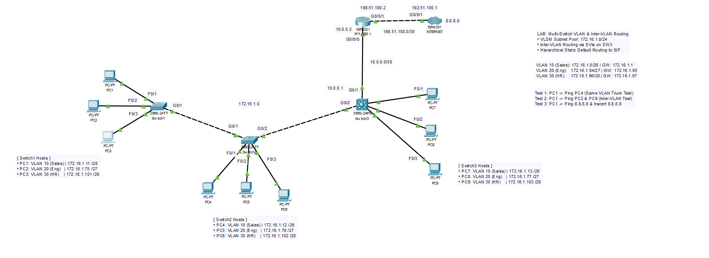
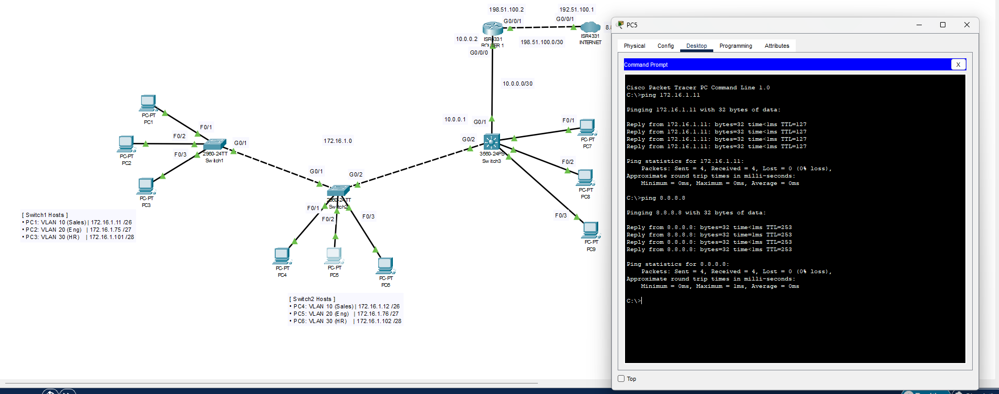
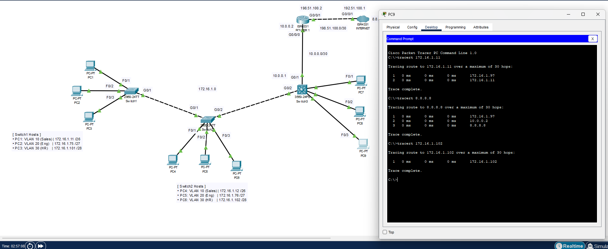

# Multi-Switch VLAN Segmentation, Inter-VLAN Routing & ISP Uplink

## Topology Overview

This project demonstrates enterprise Layer 2 segmentation, 802.1Q trunking across multiple access/distribution switches, Switched Virtual Interfaces (SVIs) on a Layer 3 Catalyst core switch, and default/summary routing toward an ISP edge router.

---

## Technical Highlights
- **Layer 2 Segmentation:** 3 separate department VLANs configured across multiple 2960 switches.
- **Trunking & Security:** 802.1Q trunk encapsulation with restricted allowed-VLAN lists.
- **Layer 3 Core Switching:** Switched Virtual Interfaces (SVIs) providing default gateway resolution without Router-on-a-Stick bottlenecks.
- **VLSM IP Addressing:** Efficient allocation of the `172.16.1.0/24` network pool.
- **Routed Uplink & Default Routing:** `no switchport` routed link to an edge router with a default route (`0.0.0.0/0`) to the simulated Internet (`8.8.8.8`).

---

## Addressing & VLAN Plan

| Device | Connected Port | VLAN | Subnet / Mask | IP Address | Default Gateway |
|---|---|---|---|---|---|
| PC1 | SW1 Fa0/1 | VLAN 10 (Sales) | 172.16.1.0/26 (255.255.255.192) | 172.16.1.11 | 172.16.1.1 |
| PC2 | SW1 Fa0/2 | VLAN 20 (Engineering) | 172.16.1.64/27 (255.255.255.224) | 172.16.1.75 | 172.16.1.65 |
| PC3 | SW1 Fa0/3 | VLAN 30 (HR) | 172.16.1.96/28 (255.255.255.240) | 172.16.1.101 | 172.16.1.97 |
| PC4 | SW2 Fa0/1 | VLAN 10 (Sales) | 172.16.1.0/26 (255.255.255.192) | 172.16.1.12 | 172.16.1.1 |
| PC5 | SW2 Fa0/2 | VLAN 20 (Engineering) | 172.16.1.64/27 (255.255.255.224) | 172.16.1.76 | 172.16.1.65 |
| PC6 | SW2 Fa0/3 | VLAN 30 (HR) | 172.16.1.96/28 (255.255.255.240) | 172.16.1.102 | 172.16.1.97 |
| PC7 | SW3 Fa0/1 | VLAN 10 (Sales) | 172.16.1.0/26 (255.255.255.192) | 172.16.1.13 | 172.16.1.1 |
| PC8 | SW3 Fa0/2 | VLAN 20 (Engineering) | 172.16.1.64/27 (255.255.255.224) | 172.16.1.77 | 172.16.1.65 |
| PC9 | SW3 Fa0/3 | VLAN 30 (HR) | 172.16.1.96/28 (255.255.255.240) | 172.16.1.103 | 172.16.1.97 |
| SW3 (SVIs) | Virtual | 10, 20, 30 | — | .1 per VLAN | — |
| SW3 Uplink | Gi0/1 (Routed) | — | 10.0.0.0/30 (255.255.255.252) | 10.0.0.1 | — |
| Edge Router | Gi0/0/0 | — | 10.0.0.0/30 (255.255.255.252) | 10.0.0.2 | — |
| Edge Router | Gi0/0/1 | — | 198.51.100.0/30 (255.255.255.252) | 198.51.100.2 | — |
| ISP Router | Gi0/0/1 | — | 198.51.100.0/30 (255.255.255.252) | 198.51.100.1 | — |
| ISP Loopback | Loopback0 | Simulated Web | 8.8.8.8/32 (255.255.255.255) | 8.8.8.8 | — |

---

## Verification & Test Results

### 1. Inter-VLAN Routing Verification
Ping from PC1 (VLAN 10) to PC2 (VLAN 20) and PC9 (VLAN 30):

### 2. Internet Reachability & Path Tracing
Traceroute from PC1 to 8.8.8.8 verifying all routing hops:

---

## How to Run This Lab
1. Download the [`lab-topology.pkt`](lab-topology.pkt) file.
2. Open it in Cisco Packet Tracer (v8.0 or higher).
3. Test end-to-end connectivity using the test commands in the verification section.
