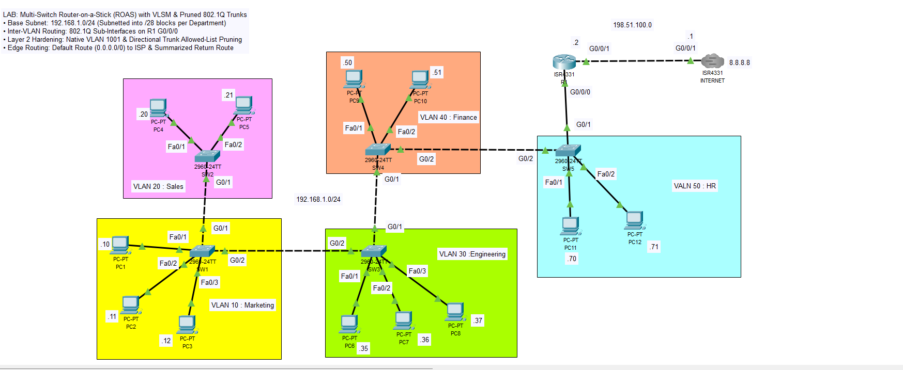
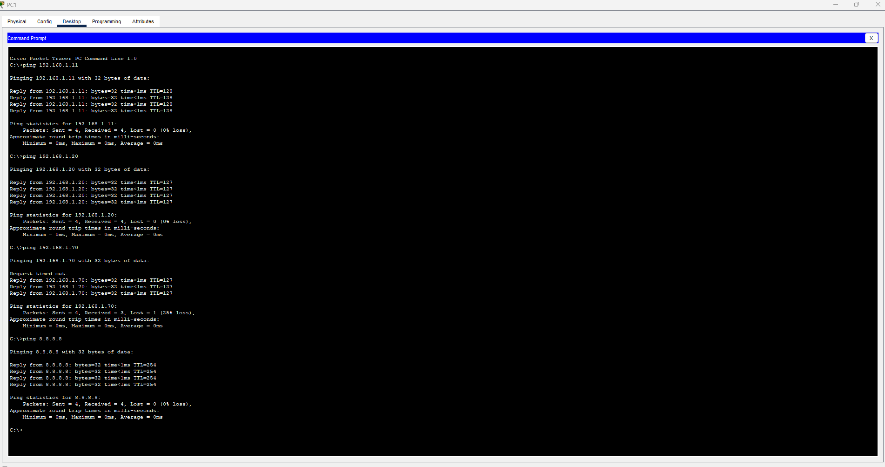
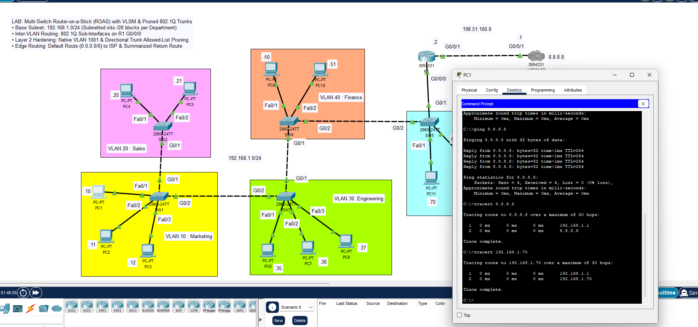

# Multi-Switch Router-on-a-Stick (ROAS) with VLSM & Pruned 802.1Q Trunks

## Topology Overview

This project demonstrates a multi-switch branch network architecture using **Router-on-a-Stick (ROAS)** for Inter-VLAN routing, directional 802.1Q trunk allowed-list pruning, Native VLAN isolation (`VLAN 1001`), and VLSM subnet allocation across 5 distinct departments.

---

## Technical Highlights
- **Router-on-a-Stick Architecture:** Centralized Layer 3 Inter-VLAN routing via 802.1Q sub-interfaces on a single physical router interface (`Gi0/0/0`).
- **Trunk Allowed-List Pruning:** Granular bandwidth optimization and broadcast containment by permitting only necessary VLANs across daisy-chained trunk uplinks.
- **Layer 2 Security Hardening:** Reassigned the default Native VLAN from `VLAN 1` to an unused ID (`VLAN 1001`) to mitigate VLAN hopping attacks.
- **VLSM Subnet Efficiency:** Partitioned a single `192.168.1.0/24` parent network into `/28` blocks (14 usable hosts each) across 5 departments.
- **Hierarchical Edge & ISP Routing:** Default routing (`0.0.0.0/0`) to the simulated ISP with summarized return routing (`192.168.1.0/24`) back to the branch gateway.

---

## Addressing & VLAN Plan

| Department | Switch | VLAN ID | Network Address | Usable Range | Default Gateway (R1 Sub-if) | Subnet Mask |
|---|---|---|---|---|---|---|
| **Marketing** | SW1 | **VLAN 10** | `192.168.1.0/28` | `192.168.1.1 - 192.168.1.14` | `192.168.1.1` (`G0/0/0.10`) | `255.255.255.240` |
| **Sales** | SW2 | **VLAN 20** | `192.168.1.16/28` | `192.168.1.17 - 192.168.1.30` | `192.168.1.17` (`G0/0/0.20`) | `255.255.255.240` |
| **Engineering** | SW3 | **VLAN 30** | `192.168.1.32/28` | `192.168.1.33 - 192.168.1.46` | `192.168.1.33` (`G0/0/0.30`) | `255.255.255.240` |
| **Finance** | SW4 | **VLAN 40** | `192.168.1.48/28` | `192.168.1.49 - 192.168.1.62` | `192.168.1.49` (`G0/0/0.40`) | `255.255.255.240` |
| **HR** | SW5 | **VLAN 50** | `192.168.1.64/28` | `192.168.1.65 - 192.168.1.78` | `192.168.1.65` (`G0/0/0.50`) | `255.255.255.240` |
| **WAN Link** | — | — | `198.51.100.0/30` | `198.51.100.1 - 198.51.100.2` | R1 `G0/0/1`: `198.51.100.2` | `255.255.255.252` |
| **ISP Loopback** | — | — | `8.8.8.8/32` | `8.8.8.8` | Simulated Public Internet | `255.255.255.255` |

---

## Host Configuration Mapping

| Host | Connected Port | VLAN Assignment | IP Address | Subnet Mask | Default Gateway |
|---|---|---|---|---|---|
| **PC1** | SW1 Fa0/1 | VLAN 10 (Marketing) | `192.168.1.10` | `255.255.255.240` | `192.168.1.1` |
| **PC2** | SW1 Fa0/2 | VLAN 10 (Marketing) | `192.168.1.11` | `255.255.255.240` | `192.168.1.1` |
| **PC3** | SW1 Fa0/3 | VLAN 10 (Marketing) | `192.168.1.12` | `255.255.255.240` | `192.168.1.1` |
| **PC4** | SW2 Fa0/1 | VLAN 20 (Sales) | `192.168.1.20` | `255.255.255.240` | `192.168.1.17` |
| **PC5** | SW2 Fa0/2 | VLAN 20 (Sales) | `192.168.1.21` | `255.255.255.240` | `192.168.1.17` |
| **PC6** | SW3 Fa0/1 | VLAN 30 (Engineering) | `192.168.1.35` | `255.255.255.240` | `192.168.1.33` |
| **PC7** | SW3 Fa0/2 | VLAN 30 (Engineering) | `192.168.1.36` | `255.255.255.240` | `192.168.1.33` |
| **PC8** | SW3 Fa0/3 | VLAN 30 (Engineering) | `192.168.1.37` | `255.255.255.240` | `192.168.1.33` |
| **PC9** | SW4 Fa0/1 | VLAN 40 (Finance) | `192.168.1.50` | `255.255.255.240` | `192.168.1.49` |
| **PC10** | SW4 Fa0/2 | VLAN 40 (Finance) | `192.168.1.51` | `255.255.255.240` | `192.168.1.49` |
| **PC11** | SW5 Fa0/1 | VLAN 50 (HR) | `192.168.1.70` | `255.255.255.240` | `192.168.1.65` |
| **PC12** | SW5 Fa0/2 | VLAN 50 (HR) | `192.168.1.71` | `255.255.255.240` | `192.168.1.65` |

---

## Verification & Test Results

### 1. Inter-VLAN & Intra-VLAN Reachability
Verification tests from **PC1** showing local Layer 2 intra-VLAN delivery, routed Inter-VLAN traversal to remote departments (Sales & HR), and full reachability to the simulated public DNS server (`8.8.8.8`):

### 2. Path Tracing & Hop Verification
Traceroute tests from **PC1**:
- **Inter-VLAN Path (`PC1` to `PC11` in HR):** Traffic traverses the switch trunk chain up to `R1` gateway sub-interface `192.168.1.1` (`G0/0/0.10`), gets routed to `192.168.1.65` (`G0/0/0.50`), and returns downstream to destination host `192.168.1.70`.
- **Internet Uplink Path (`PC1` to `8.8.8.8`):** Hop 1 hits `192.168.1.1` (R1) $\to$ Hop 2 hits `198.51.100.1` (ISP) $\to$ Destination reached (`8.8.8.8`).

---

## How to Run This Lab
1. Download the [`lab-topology.pkt`](lab-topology.pkt) file.
2. Open it in Cisco Packet Tracer (v8.0 or higher).
3. Verify connectivity using `ping` and `tracert` commands across the different department hosts.